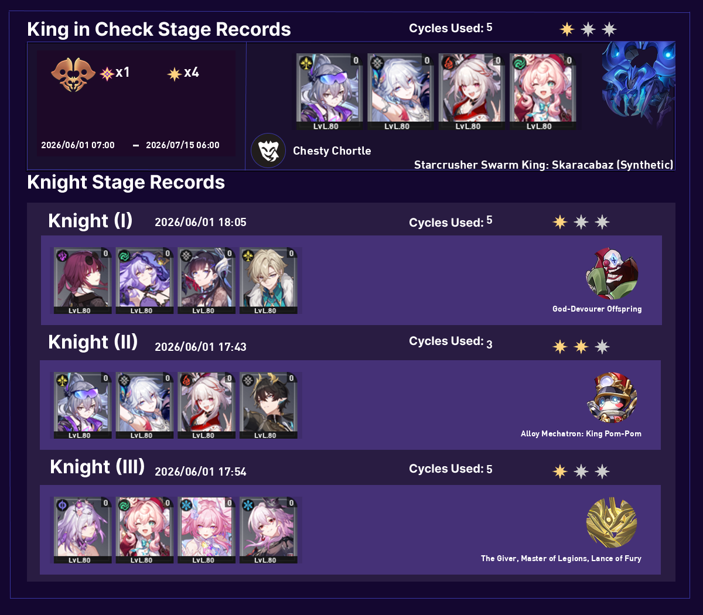
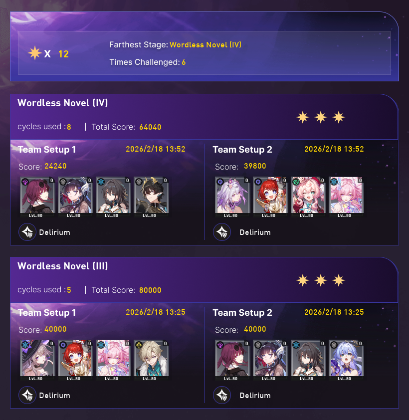
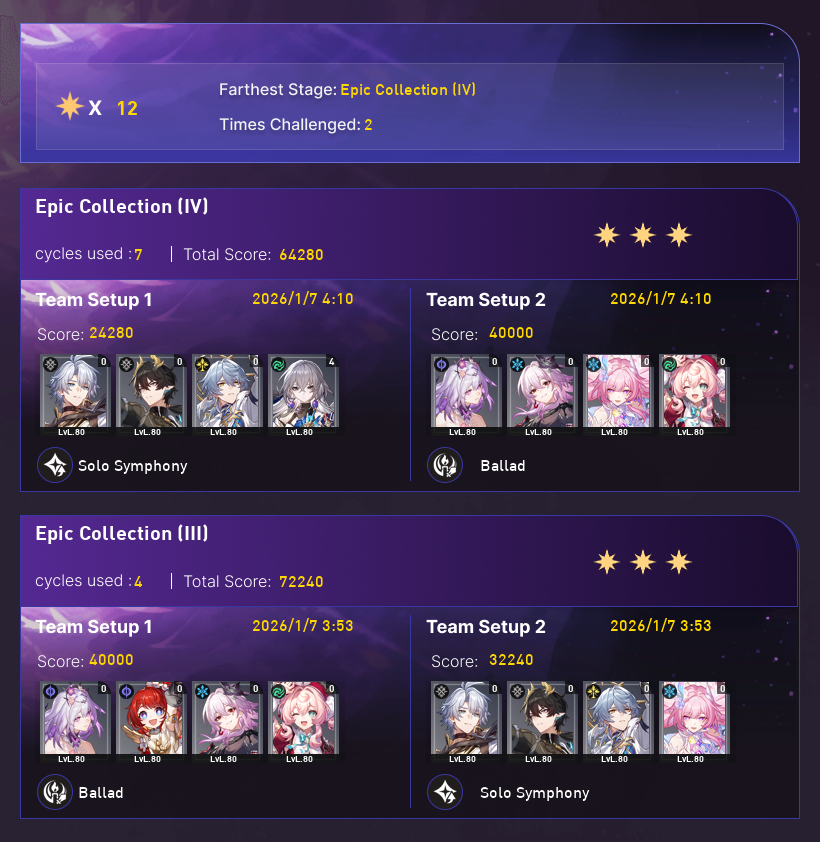
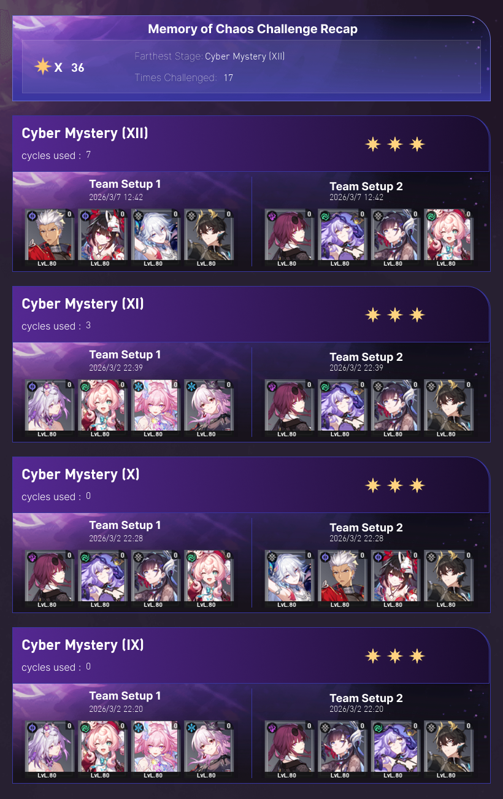
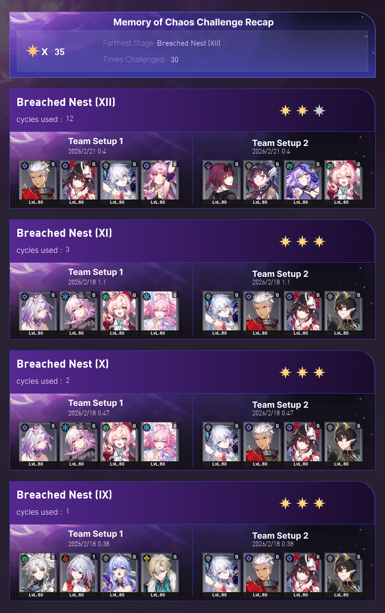
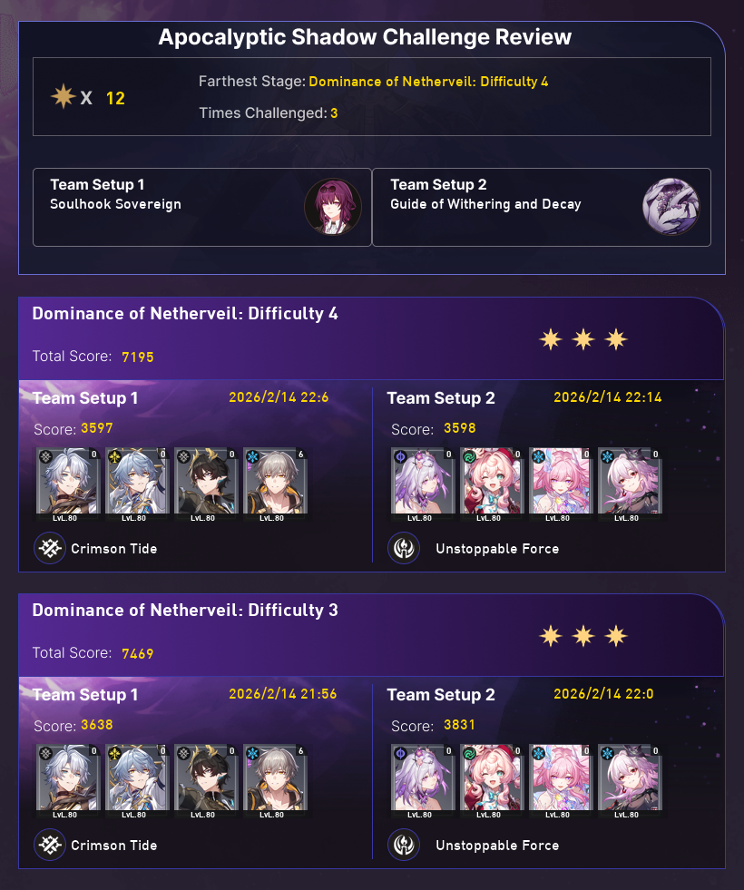
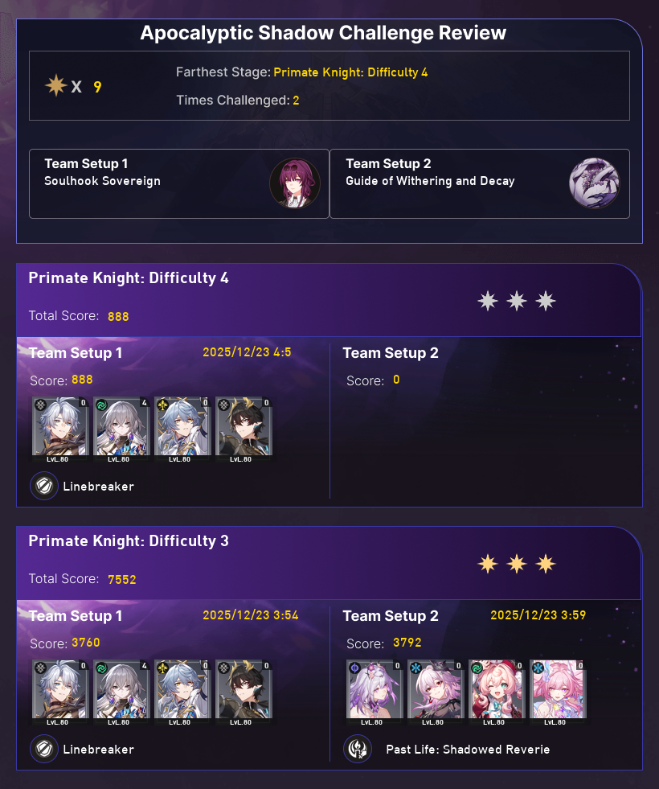

# Honkai Star Rail Cards

A Python library to generate beautiful battle cards for Honkai Star Rail .

## Features

- Render player anomaly cards
- Generate Pure Fiction (PF) stats cards
- Create Memory of Chaos (MOC) cards
- Generate Apocalyptic Shadow (AS) cards
- Clean, type-hinted interface

## Installation

### From PyPI
```bash
pip install hsr-cards
```

### From source
```bash
git clone https://github.com/MR-LORD-REX/hsr-cards.git
cd hsr-cards
pip install -e .
```

## Quick Start

```python
from hsr_cards import HonkaiStarrail
import asyncio
import os
from dotenv import load_dotenv

load_dotenv()

async def test():
    try:
        os.makedirs("Cards", exist_ok=True)
        async with HonkaiStarrail("800556377") as client:
            img=await client.anomaly()
            img.save(f"Cards/Anomaly.png")
            print(f"saved Cards/Anomaly.png")
            
            for i in range(1,3):
                img=await client.PF(schedule_type=str(i))
                img.save(f"Cards/PF_{i}.png")
                print(f"saved Cards/PF_{i}.png")
                
                img=await client.MOC(schedule_type=str(i))
                img.save(f"Cards/MOC_{i}.png")
                print(f"saved Cards/MOC_{i}.png")
                
                img=await client.shadow(schedule_type=str(i))
                img.save(f"Cards/AS_{i}.png")
                print(f"saved Cards/AS_{i}.png")
                
    except Exception as e:
        print(f"Error during test: {e}")
        pass

asyncio.run(test())
```

## Preview

Below are some example cards generated by this library.

### Anomaly


### Pure Fiction (PF)
 

### Memory of Chaos (MOC)
 

### Apocalyptic Shadow (AS)
 

## Requirements

- Python 3.10+
- aiohttp
- Pillow (PIL)
- python-dotenv
- asyncio
- cookies from hoyolab

## API Reference

### `HonkaiStarrail(uid)`

Main client class for generating cards.

**Parameters:**
- `uid` (int | str): Your Honkai Star Rail UID

**Methods:**
- `anomaly()` → Image: Generate anomaly card
- `PF(schedule_type)` → Image: Generate Pure Fiction card
- `MOC(schedule_type)` → Image: Generate Memory of Chaos card
- `shadow(schedule_type)` → Image: Generate Apocalyptic Shadow card

All methods are async and return PIL Image objects.

## Environment Variables

Create a `.env` file in your project root (see `.env_example`):

```
ltoken_v2=v2_CAISdKm9p8FxQ3sZ4gT0RJlkfFn3NbX7tCmmE9ff0ZqjKaB2xPkHYqThZsFQPP5is4NCd2Rjc19vdmVyc2Vh.GxGYbRBBBBBD.MVRCIDFy85cHYgYnvbC4tLpI8wZx0NKq0nq5SKz6o9cE1h_hCjBq2igWd0n4ZBU1rSI52elPNjsgFHz2IRrKLbuI8O7lB
ltuid_v2=242012003
```

## License

MIT License - see LICENSE file for details

## Contributing

Contributions are welcome! Please feel free to submit a Pull Request.

## Disclaimer

This library is not affiliated with or endorsed by HoYoverse. Use at your own risk and in compliance with the game's Terms of Service.
